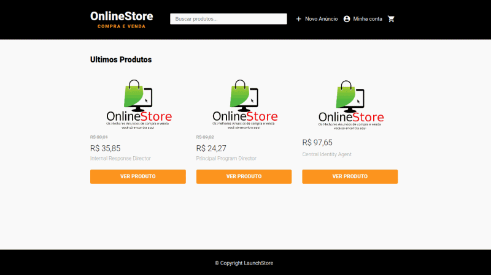
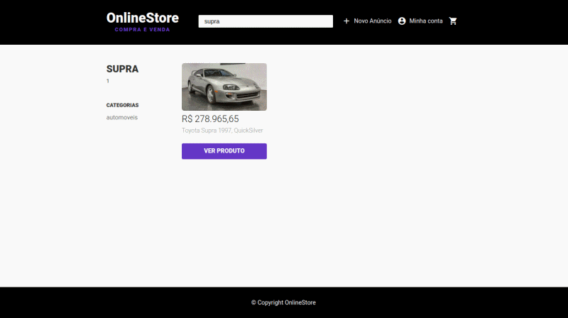

<h1 align="center">
    
</h1>

<h2 align="center">
  Online Store
  
Os melhores Anúncios você pode encontrar aqui.

</h2>

  
  
  

## Tópicos 

[Sobre o OnlineStore](#Sobre-o-OnlineStore)

[Funcionalidades](#funcionalidades)

[Tecnologias e Ferramentas](#tecnologias-e-ferramentas)

 

## Sobre o OnlineStore

O OnlineStore é um e-Commerce. Um sistema de compra e venda de produtos. Os usuários cadastrados, poderão cadastrar seus produtros, vizualizar outros produtos de seu interesse e também poderão finalizar a compra de um produto. 

<h3 align="center">Main</h3>

  

 

<h3 align="center">Processo de Compra de Produto</h3>

  

 

## Funcionalidades

-  [X] Cadastro de usuários.
 - [X] Criação de anúncios.
 - [X] Realização de pedidos.
 - [X] Carrinho de compras.
 - [X] Buscar produtos.
 - [X] Upload de imagems com Multer.
 - [X] Páginas dinâmicas com Nunjucks.
 - [X] Banco de dados PostgreSQL.
 - [X] Sistema de login e recuperação de senha.
 - [X] Animações com Lottie.

 

## Tecnologias e Ferramentas

As seguintes tecnologias foram utilizadas no desenvolvimento do projeto:

- [HTML](https://devdocs.io/html/)
- [CSS](https://devdocs.io/css/)
- [JavaScript](https://devdocs.io/javascript/)
- [Nunjucks](https://mozilla.github.io/nunjucks/)
- [NodeJS](https://nodejs.org/en/)
- [Nodemailer](https://nodemailer.com/about/)
- [Express](https://expressjs.com/)
- [Express Session](https://github.com/expressjs/session)
- [Multer](https://github.com/expressjs/multer)
- [PostgreSQL](https://www.postgresql.org/)
- [BcryptJS](https://github.com/dcodeIO/bcrypt.js)
- [Faker.js](https://github.com/Marak/Faker.js)

 

---

Feito com :purple_heart: by [Michael W.Lopes](https://github.com/michael23-lopes)

 
